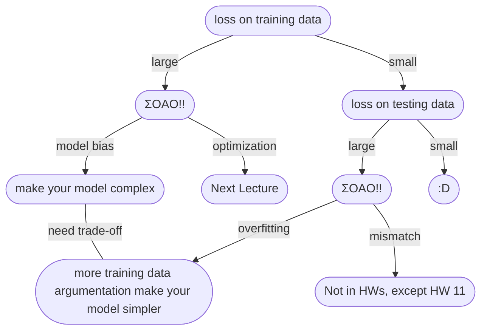

# Lecture 1 & Lecture 2

## 機器學習基本概念簡介

### 何謂機器學習

**Q: 什麼是機器學習?** 
*A: 概括來說，讓機器具備找一個函式的能力!*

### 函數的類型

上面提到機器要找一個函數，這個函數被大致分為幾種

* **Regression:** 輸出為一個數值  

* **Classification:** 從既有的選項 *(classes/類別)* 中，選擇其一輸出

* **Structured Learning:** 讓機器產生一個有結構的物件 *(e.g. 畫一張圖、寫一篇文章...)* ，讓機器學會創造

### 如何找一個函數

**以簡單預測YouTube流量為例...**

#### 1. **Find with Unknown Parameters** 寫出帶有未知參數的函式

#### 2. **Define Loss form Training Data** 定義損失函數

    * Loss is a function of parameters: L(b, w)
    * Loss: how good a set of value is

Loss: $L = \frac{1}{N}\Sigma e_n$

將每一天的誤差值加總起來取平均，就能得到損失函數的值 
計算誤差值的方式大致上有下列2種方法:

* **MAE** Mean Absolute Error
    $e = |y - \hat{y}|$
* **MSE** Mean Square Error
    $e = (y - \hat{y})^2$

依照需求和對任務的理解作選擇 
*如果* $y$ *和* $\hat{y}$ *都是機率分佈的話，則會選擇Cross-entropy(之後再說)*

**Error Surface:**
將各種參數組合出來的Loss值繪製成等高線圖

#### 3. **Optimization** 最佳化

$$w^*, b^* = \arg\min\limits_{w, b}L$$
*找一個最好的* $w$*和* $b$ *(* $w^*$ & $b^*$ *)，使得Loss的值最小*
**Gradient Descent:**
先遮住另一個參數，我們先看單一的參數...

:::info
$\eta$ : learning rate *(a hyperparameters 自己設定的參數)* 
larning rate越高，學習越快 *(數值變化快)*
:::

如圖，Gradient Descent顯而易見的問題即是local minima問題，通常無法找到golbal minima，但老師提到local minima其實是個假議題，做Gradient Descent時會遇到的真正難題並不是local minima問題 *(之後再提Gradient Descent真正的痛點)* 
單一的參數理解之後，多個參數也是相同概念...

* (Randomly) Pick initial values $w^0, w^b$
* Compute
$$
\begin{align*}
w^1&\leftarrow w^0-\eta\frac{\delta L}{\delta w}|_{w = w^0, b = b^0} \\
b^1&\leftarrow b^0-\eta\frac{\delta L}{\delta b}|_{w = w^0, b = b^0}
\end{align*}
$$
* Update $w$ and $b$ interatively

### 訓練 & 預測

上面的步驟其實就是在訓練

如圖，在已知的資料上的最小Loss是0.48k，而在預測的數據上，Loss則是來到0.58k   

 
根據第一次預測的結果，我們可以發現這些資料有存在週期性 *(在此為7天一循環，星期四和星期五的觀看人數都會減少)*，利用這個週期性來嘗試修改模型... 
以上這些`feature * weight + bias`的模型就稱為 **Linear Models**

### 模型

Linear Models很顯然是不夠的，它有著很大的限制，稱作**Model Bias**，使得這個模型無法模擬真實的狀況，因此我們需要更複雜、更有彈性的模型

**Piecewise Linear Curves**
上面這條紅線其實就是Piecewise Linear Curves *(分段線性曲線)*，我們可以發現這種曲線可以整理成下列的式子: 
red curve = constant + sum of a set of blue cruve

如圖，利用不同的藍色曲線加上一個常數，就形成了紅色分段線性曲線 *(red curve = 0 + 1 + 2 + 3 curves)*

**Q: 但x和y的關係不一定是Piecewise Linear Curves啊，那該怎麼辦?** 
*A: 先在曲線上取幾個點，再連起來形成Piecewise Linear Curves，只要點取得夠好或**夠多**，就能和原本的曲線非常接近*
   
**Q: 那要如何得到藍色曲線呢?** 
*A: 我們可以用**Sigmoid Function**來嘗試逼近它*
   
而我們上面一直在講的藍色曲線則是叫做**Hard Sigmoid**
   
透過改變$w$、$b$和$c$，就能去逼近出各種不同的Sigmoid Function

   
回到這一張圖...

我們就成功把紅色分段曲線表示出來了 

**整理一下我們的新模型:**

* 單個feature
$$y = b + wx_1\\\downarrow\\ y = b + \sum_i \color{red}{c_i}sigmoid(\color{green}{b_i} + \color{blue}{w_i}x_1)$$
* 多個feature

$$y = b + \sum_j w_jx_j\\\downarrow\\ y = b + \sum_i \color{red}{c_i}sigmoid(\color{green}{b_i} + \sum_j \color{blue}{w_{ij}}x_j)$$
 

下面實際演示了這個模型...
   
可以將 $r_1$、 $r_2$ 和 $r_3$ 的運算簡寫成如下:
   
接著，將 $r_i$ 代入 $sigmoid$ 函數得到 $a_i$ (可表示成 $a = \sigma(r)$， $a$ 、 $r$ 是矩陣， $\sigma$ 是 $sigmoid$ )，最後加上 $b$ 得到 $y$ ，如下圖:
   
經過整理後得到 $y$ 的線性代數表達法:
   
接著將每個未知參數組成一個很長的向量矩陣 $\theta$:
   
這樣我們就重新定義了機器學習的第一步

### 新模型的Loss函數 & 最佳化

#### Loss函數

代入的參數由原本的 $w$ 和 $b$ 換成了 $\theta$
$$L(w, b)\rightarrow L(\theta)$$

可以發現，除了參數不一樣以外，其他都和上面介紹的Loss函數一樣

#### 最佳化

$$
\theta^* = \arg\min\limits_{\theta}L,
\theta =
\left[
\begin{matrix}
& \theta_1\\
& \theta_2\\
& \theta_3\\
& \vdots &
\end{matrix}
\right]
$$

* (Randomly) Pick initial values $\theta^0$
* Compute gradient $g$

$$
g =
\left[
\begin{matrix}
& \frac{\delta L}{\delta\theta_1}|_{\theta = \theta^0} \\
& \frac{\delta L}{\delta\theta_2}|_{\theta = \theta^0} \\
& \vdots &
\end{matrix}
\right],
\left[
\begin{matrix}
& \theta_1^1 \\
& \theta_1^2 \\
& \vdots &
\end{matrix}
\right] \leftarrow
\left[
\begin{matrix}
& \theta_0^1 \\
& \theta_0^2 \\
& \vdots &
\end{matrix}
\right] -
\left[
\begin{matrix}
& \color{red}{\eta}\frac{\delta L}{\delta\theta_1}|_{\theta = \theta^0} \\
& \color{red}{\eta}\frac{\delta L}{\delta\theta_2}|_{\theta = \theta^0} \\
& \vdots &
\end{matrix}
\right]
$$
$$g = \nabla L(\theta^0), \theta^1 = \theta^0 - \color{red}{\eta}g$$

* 不停地做直到gradient為零向量 *(Zero Vector)* 或不想做為止

**實作上，我們會將N筆資料切成一個一個Batch...**

每做一個Batch就會**update**一次，把所有Batch都做完一輪稱為**1 epoch**

:::success
:mag_right: **Example**  

#### Example 1

* 10000 examples (N = 10000)
* Batch size is 10 (B = 10) 
How many update in **1 epoch**? 
*A: 10000 / 10 = **1000 updates***   

#### Example 2

* 1000 examples (N = 1000)
* Batch size is 100 (B = 100) 
How many update in **1 epoch**? 
*A: 1000 / 100 = **10 updates***
:::

### ReLU

其實不一定要像上面透過**Sigmoid**函數來近似，也可以將
**Hard Sigmoid**
看成兩個 **Rectified Linear Unit (ReLU)** 的加總

:::info
:information_source: 這裡的 $\color{red}{2}i$ 是因為要合成1條**Hard Sigmoid**需要2條**ReLU**
:::
**Q: 那這上面兩個哪個比較好呢?**  
*A: ReLU，老師接下來的實驗都選擇了ReLU，顯然ReLU比較好 (至於為什麼，之後再講)*

### 實際實驗結果

越多的ReLU可以製造越複雜的曲線，不過到了1000個ReLU之後，雖然在訓練資料上有更低的Loss，但在預測上就沒有太大的進步  
接著我們繼續改進模型...

可以多做幾次: $x\rightarrow a\rightarrow a'\rightarrow \cdots$
這個也是**Hyper Parameter**，要自己決定做幾層，下面有實際的實驗數據...  

增加層數，在訓練資料上Loss有顯著的降低，在預測上也有進步   

可以發現在兩周一次的低谷的在預測上算是蠻精準的，不過這裡有個很有趣的地方，也就是在 ? 的地方，嚴重高估了觀看數值，這其實也不太能怪它預測的不精準，這一天其實是除夕，所以觀看數比預期的低很多

### 神經網路 & 深度學習

:::info
Many Neuron $\rightarrow$ Neuron Network 
Many hidden layer $\rightarrow$ Deep $\rightarrow$ Deep Learning
:::
於是人們把類神經網路越疊越多、越疊越深...

:::success
不過要訓練這麼深的Network是有訣竅的，這個之後再講...
:::

**Q: 要逼近一個複雜的函數，實際上只要有夠多的ReLU和Sigmoid就可以逼近任何的連續函數，理論上只要一排ReLU或Sigmoid夠多就足夠了，為何要深呢? 胖不行嗎? 只是單純"Deep" Network比"Fat" Network看起來更厲害嗎? 為何我們不要把Network變胖，而是變深呢?** 
*A: 好問題! 之後會再講*

**Q: Deep Network越深就一定越好嗎?** 
*A: 不一定，有可能會出現 **Overfitting(過度擬合)** 的現象*

## 機器學習任務攻略

:::info
:information_source: trade-off: split your training data into training set and validation set for model selection
:::

 

:::warning
:pushpin: **狀況1: 訓練資料的Loss就很大!!**  
*可能是Model Bias或Optimization Issue*
:::

### Model Bias

這個狀況是Model太過簡單了，導致在這個一堆函數所成的集合裡面，即便是最好 *(讓Loss最低)* 的函數Loss也還是很高。換句話說，就是可以讓Loss變低的函數，不在這個model可以描述的範圍之內。下圖清楚的表示了這個狀況...
:::info
:paperclip: 老師這裡下了一個比喻: 就好比你在大海撈針，但海裡根本沒有針
:::

:::success
:heavy_check_mark: **解決方法:** 重新設計model讓它更有 "彈性" !  

:::

### Optimization Issue

目前我們只學到gradient descent的方法做optimization，這個方法有個顯而易見的問題: 通常無法找到golbal minima!  
  
這個model裡面確實有存在一個函數的Loss是夠低的，但gradient descent卻沒有給我們這個函數
:::info
:paperclip: 老師這裡也下了一個比喻: 就好比你在大海撈針，針確實在海裡，但我們卻沒辦法把針撈起來(找不到QAQ)
:::

### Model Bias v.s. Optimization Issue

這個時候就會開始吶喊，蛤所以到底是哪個狀況啊? 到底是model不夠大，還是model夠大了，只是我們沒辦法找到夠好的函數? 該怎麼判斷呢?
:::success
可以透過比較不同的model來得知說model到底夠不夠大!
:::
先來看下面的實例...

試著分析一下，首先我們看到在Testing Data這方面，56-layer的Loss比20-layer的Loss高，先別以為就是overfitting，我們再看一下Training Data，發現56-layer的Loss還是比20-layer來得高，如果是overfitting理論上56-layer在Training Data上應該要比20-layer有更低的Loss，==但這個狀況卻是不管Testing Data還是Training Data都是56-layer有更高的Loss，代表這是Optimization Issue，56-layer沒做好optimization，找不到更低Loss的函數，所以Loss才會比20-layer高!==
:::info
:bulb: **老師的建議**  
遇到沒做過的問題，可以先跑一些比較小、比較淺的network，或是用一些不是deep learning的方法 *(e.g. linear model, support vector machine...)* ，這些model是比較容易做optimize的，比較不會有optimization失敗的問題，之後便於和深的model比較Loss
:::
這也是Optimization Issue，發生在5 layer

:::success
:heavy_check_mark: **解決方法:** 更強大的Optimization技術!! *(下一節課再講)*
:::

### Overfitting & Mismatch

:::warning
:pushpin: **狀況2: 訓練資料的Loss小，但是測試資料的Loss大!!** 
*可能是Overfitting或Mismatch*
:::
下面舉一個極端的例子...
:::success
:mag_right: **An extreme example**  
Training data:
$$\{(x^1, \hat{y^1}), (x^2, \hat{y^2}), \dots, (x^N, \hat{y^N})\}$$
Model:
$$
f(x) =
\begin{cases}
\hat{y^i} & \exists x^i = x \\
random & otherwise
\end{cases}
$$
This function obtains **zero training loss**, but **large testing loss.**
:::
上面可以看到，這個函數簡直一無是處，如果訓練資料有相同的 $x^i$ 就輸出跟訓練資料一模一樣的 $\hat{y^i}$ ，如果沒有，就隨機輸出。雖然在training data上的loss是0，但拿到testing data上的表現是極為糟糕的  

**日常會遇到的例子:**

太過有彈性的model在沒有訓練到的地方就會有 **"freestyle"** 導致在Testing data有較大的Loss
:::success
:heavy_check_mark: **解決方法:**  

1. 增加訓練資料!  *只要有更多的訓練資料就能限制住函數的形狀，減少"freestyle"的發生* *(不可在作業中使用)* 但可以使用: Data Augmentation  *e.g. 將圖片左右翻轉、截一塊出來放大...(但是要合理)*
   
2. 給模型一些限制!  
*要給多少限制取決於自己對問題的理解 ~~(自己通靈)~~*
  
*限制的方法:*  

    * Less parameters, sharing parameters
    * Less features
    * Early stopping
    * Regularization
    * Dropout

:::

**CNN**  
  
相比一般的Fully-connected架構，CNN的限制較多，它可以找到函數較少，但它因為針對影像的特性來限制model，所以CNN在影像上的表現較好
:::danger
:x: **注意 限制不可過多**  
限制過多 $\rightarrow$ model bias問題  

:::

**Bias-Complexity Trade-off**

**Cross Validation**  
為了避免糾結在public testing set上面，應該將training set拆出validation set *(通常9:1)* 根據validation set出來的loss來挑選模型

但是這樣可能會遇到一個問題，如果分得不好，剛剛好奇怪的data都分到validation set，導致結果很差怎麼辦? $\rightarrow$ **N-fold Cross Validation** !!

**N-fold Cross Validation**  
先將training set分成N等份，將其中一份拿來當validation set，其餘當training set，重複N次，將每個model每次的loss加總起來平均並比較，找到loss最小的model，最後再把所有的training set給loss最低的model，就可以拿去跑testing set了，下圖以N = 3舉例說明...

### Mismatch

訓練資料 和 測試資料 分佈不一樣 *(大部分作業不會遇到這種問題，除了HW11)*

## 類神經網路訓練不起來怎麼辦 (一)： 局部最小值 (local minima) 與鞍點 (saddle point)

### 為什麼Optimization會失敗?

隨著參數不斷update，training loss卻不再下降至滿意的數值，甚至是一開始model就訓練不起來...$\rightarrow$ 走到了一個地方，參數對loss的微分為0，使得gradient descent沒辦法再update參數

:::warning
:warning: **注意**  
這個時候通常會想到local minima問題，但事實上並不是只有local minima的gradient是0，比如說: **鞍點 (saddle point)**，這些gradient是0的地方，我們通稱 **關鍵點 (critical point)**
:::

* **local minima:** :x: no way to go
* **saddle point:** :heavy_check_mark: can escape

### 判斷 Local Minima 和 Saddle Point

想要知道一個點到底是local minima還是saddle point $\rightarrow$ 要知道loss function的形狀 $\rightarrow$ 但loss function極為複雜，要如何知道它的形狀呢?

雖然不知道 $L(\theta)$ 的樣子，但可以從 $L(\theta')$ 去逼近它   

在critical point的時候，gradient為0，因此 $(\theta - \color{blue}{\theta'})^T\color{green}{g}$ 這一項為0，我們可以根據 $\frac{1}{2}(\theta - \color{blue}{\theta'}^T)\color{red}{H}(\theta - \color{blue}{\theta'})$ 這項來判斷 $\color{blue}{\theta'}$ 附近的error surface長什麼樣子，進而知道 $\color{blue}{\theta'}$ 是local minima還是saddle point  

:::info
[:information_source: 如何計算矩陣的特徵值(eigen values)](https://silverwind1982.pixnet.net/blog/post/154593170)
:::

**由Hessian判斷關鍵點:**  

:::success
:mag_right: **Example**   

   
**$\lambda_1, \lambda_2$ 的計算過程:**
$$
\begin{align*}
&\color{red}{H} =
\left[
\begin{matrix}
& 0 & -2 \\
& -2 & 0 &
\end{matrix}
\right] \\
&det{
\left(
\left[
\begin{matrix}
& 0 - \lambda & -2 \\
& -2 & 0 - \lambda &
\end{matrix}
\right]
\right)
} = 0
\end{align*}
$$
$$
\begin{align*}
∴& \lambda^2 - 4 = 0, \quad\lambda^2 = 4, \quad\lambda = \pm 2 \\
∴& \lambda_1 = 2, \quad\lambda_2 = -2
\end{align*}
$$
:::
 

**參數可以update的方向:**  

簡單來說， $\theta = \color{blue}{\theta'} + u$ 就可以讓loss變小
:::success
:mag_right: **Example**   

:::
:::danger
:exclamation: 但是因為上述方法的運算量巨大，所以幾乎不會在實作中使用
:::

### Saddle Point v.s. Local Minima

**Q: 既然saddle point比較不可怕，那我們如果比較常遇到的是saddle point，是不是就能比較不用擔心? 到底哪個常見呢?**  
*A: [我們先進一段小故事! (魔法師狄奧倫娜)](https://aijianggu.com/collect/835222.html)*
  
這個故事給我們了一個啟發: 三維空間無路可走的地方，在四維或是更高維的空間是不是有可能還有路可以走呢?

如圖，在二維空間中看似local minima的地方，在三維空間中卻可能是saddle point，在動輒有百萬、千萬參數 *(百萬、千萬維度)* 的model中，是不是其實有很多路可以走呢?  

**真實實驗案例:**

可以發現，即使是在最極端的狀況下，還是有幾乎一半的路是可以讓loss下降的，無路可走(local minima)的狀況並不常見

## 類神經網路訓練不起來怎麼辦 (二)： 批次 (batch) 與動量 (momentum)

### Batch

:::info
:paperclip: **複習**   

:::
1 **epoch** = see all the batches once $\rightarrow$ **Shuffle** after each epoch *(每個epoch都會重新分batch)*

從這一張圖我們可以看到，大的Batch雖然需要的時間比較久，但卻比較精準，而小的Batch需要的時間比較小，但比較不準，不一定會朝著正確的方向前進。**但真的是這樣嗎?，你可能沒考慮到平行處理的問題!!**   
   
此為實際的實驗結果，因為GPU可以平行運算，所以當batch size是1 ~ 1000時，所需要的時間是幾乎相同的，不過GPU平行運算的能力終究有限，所以當batch size大到超過一定的大小之後，需要的時間還是會隨著batch size的增大而增加的   
   
因此，大的batch size反而是比較有效率的，所以我們回到上面的這一張圖:
   
這樣看起來，大的Batch的劣勢消失了，而小的Batch的優勢沒了。這樣看起來似乎大的Batch是比較好的，但這裡又出現了一個反直覺的地方了，**noisy的gradient反而可以幫助train**   

* Smaller batch size has better performance
* What wrong with large batch size? $\rightarrow$ Optimization Fails
 

原因在於Full Batch的時候，Loss函數是固定的，當走到critical point的時候就容易卡住，無法再得到更低的loss，但Small Batch不一樣，他每次的Loss函數都有些微的不同，如圖，雖然在$L^1$卡住了但在$L^2$就有可能可以繼續train下去   

接下來就是更弔詭的事了，經過實驗得到的數據來看，==Small Batch對於testing上有更好的表現==，即便我們努力讓Large Batch在training上跟Small Batch上有相似的Accuracy，但Large Batch在testing上還是輸給了Small Batch，也就是Large Batch上出現了overfitting，為什麼會這樣呢?   

這是因為同樣是Minima，有可能是Flat Minima，也有可能是Sharp Minima，如果training data和testing data上有mismatch，在Flat Minima上的影響可能就不太大，還是會有很好的表現，但對於Sharp Minima，一點點的mismatch就是非常致命的。而很多人相信，Small Batch比起Large Batch，更容易跑到Flat Minima，一個比較直觀的解釋是，noisy的gradient在Sharp Minima可能一個不小心就跳離開了，而Flat Minima才比較容易困住它 *(但這個還是個尚待研究的問題，這個解釋也不是100%正確)*
:::success
:memo: **Summary**  
總結一下，Small Batch和Large Batch各有優缺點，所以這也是一個要自己設定的hyperparameter

:::

### Momentum

假設error surface如下圖中的斜坡，在物理的世界中，球不一定會滾到critical point就停下來，而是會繼續滾下去，甚至動量足夠的話，還可能可以越過小山丘，往更低處前進
   
**一般Gradient Descent:**  
基本上就是一直重複算出gradient，然後往gradient的反方向移動
   
**Gradient + Gradient Descent:**  
不僅僅考慮算出來的gradient，還要考慮上一步!
   

整理一下上面的式子...  
$m^i$ is the weighted sum of all the pervious gradient: $g^0, g^1, \dots, g^{i-1}$
$$
\begin{align*}
m^0 &= 0 \\
m^1 &= -\eta g^0 \\
m^2 &= -\lambda\eta g^0 - \eta g^1
\end{align*}
$$
 

換成一開始的圖像來看的話，確實有點像物理的小球那樣，有機會滾到更低的地方

## 類神經網路訓練不起來怎麼辦 (三)：自動調整學習速率 (Learning Rate)

### 固定的 Learning Rate

上面講到了critical point的問題，但其實在訓練Network的時候，critical point往往不是最大的障礙...

當我們看到loss不再繼續往下掉的時候，可能會以為是走到了critical point，gradient趨近於0，但是gradient真的變得很小了嗎?從上面的圖片可以看出，==在loss減少的曲線這麼平緩的時候，gradient其實並沒有很小==，甚至到最後還有突然變多一點，那為什麼loss遲遲無法降低呢?其中一個可視化的例子就是左上圖，在一個峽谷中間反覆橫跳，進不去峽谷裡面。而通常在真的走到critical point之前，loss就會像這樣卡住了   

:::success
✋**修但幾咧**  
Q: 既然說loss卡住其實很少是因為卡在critical point，那麼前面的這張圖是怎麼一回是?
   
*A: 其實要訓練參數到很接近critical point，用一般的gradient descent是做不到的，要出現這樣圖要有特別的方法，正因為如此，平常我們要遇到critical point是很困難的*
:::

來看看下面這張error surface，這個橢圓形的error surface在縱軸的地方坡度非常陡峭，橫軸的地方則坡度非常平緩，雖然這是個構造單純的error surface，但gradient descent卻不見得可以把它做好
   

先來看看 $\eta = 10^{-2}$ 的狀況:  
  
參數在山地的兩端不斷震盪掉不下去，這時你可能會覺得，這是 $\eta$ 設定太大的緣故，只要調低learning rate就好了啊!   

於是不停地的調低至 $\eta = 10^{-7}$ 直到參數不再震盪:
  
但這時問題又來了，當坡度非常平滑的時候，這麼小的learning rate根本無法順利地走到目標

:::info
💡固定的learning rate顯然是不夠好的，learning rate應該要為每個參數做客製化!
:::

### 客製化 Learning Rate

主要的大方向就是，在比較陡峭的地方我們希望learning rate小一點，在平緩的地方我們希望learning rate大一點，所以我們要改造一下算式...

將 $\eta$ 改成 $\frac{\eta}{\sigma_i^t}$ 讓learning rate可以為每個參數做客製化

那如何求這個 $\sigma_i^t$ 呢?常見的方法是算gradient的**Root Mean Square**:

   
可以看到這樣的策略是有效的，當整體的坡度很平緩的時候，$\sigma_i^t$ 就小，$\frac{\eta}{\sigma_i^t}$ 就大，坡度很陡峭的時候則相反   

但上面的方法還不夠好，learning rate應該還要可以隨著時間調整，下面的圖可以看到，雖然是同一個方向，但綠色箭頭的地方卻比較陡峭，需要小的learning rate，而紅色箭頭的地方比較平緩，需要比較大的learning rate
   

於是乎就有了**RMSProp**這個方法:
   
簡單來說，相比原先的算式，多了一個 **$\alpha$** 來決定現在的gradient跟之前其他的gradient的權重   
   

而我們常用的optimization策略就是**Adam**:

:::info
ℹ️[Adam原始論文](https://arxiv.org/pdf/1412.6980.pdf)
:::
回到原本的這張圖，有了能夠自動調整的learning rate之後，就成功train起來了，至於紅色圈圈的部分，是因為走了很長一段路之後，累積了很多很小的gradient，平均下來就小了，所以learning rate又變大直接開噴，但不用擔心，噴了幾個很大的gradient之後，learning rate又會變小
   

**Q: 那要如何避免這樣的狀況呢?**  
*A: Learning Rate Scheduling!!*   
隨著不斷的update我們離終點越來越近，於是我們把learning rate減小，解決了到後面會亂噴的問題
   

Learning Rate Scheduling也不止有Learning Rate Decay這個方法，還有比如**Warm Up**這個方法:
   
這個方法在訓練之後會講的**BERT**中常常看到，但不是先有**BERT**才有**Warm Up**的。至於為什麼Warm Up這個方法會有效，雖然還沒有一個確切的答案，但可以這樣解釋: ==既然我們的learning rate是透過之前的gradient總和來進行調整的，在剛起步的時候，這個統計數據的資料還不夠多==，所以一開始先壓低learning rate，直到資料夠多的時候，才提高learning rate
:::info
ℹ️延伸閱讀: [RAdam](https://arxiv.org/abs/1908.03265)
:::

**總結一下:**  
   

學了進階的optimization方法之後，使得我們可以應付崎嶇的error surface，但有沒有可能可以把error surface直接炸平呢?如果error surface變得不那麼崎嶇，就能更利於training!

## 類神經網路訓練不起來怎麼辦 (四)：損失函數 (Loss) 也可能有影響

### Classification v.s. Regression

一般我們訓練model，是輸入一個 $x$ 得到 $y$ ，那可以利用這樣的方式去做分類嗎? 這種方法可能會有瑕疵，假如1代表class 1，2代表class 2，3代表class 3，那麼這就是在暗示class 1跟class 2比較像，而跟class 3比較不像，如果今天分類的東西有這樣的關係，那或許還說得過去，但通常不會有這樣的關係。

要如何解決上述的問題呢? 我們可以透過 **one-hot vector** 來表示每一個class:

接著我們改造一下model的輸出:

比較一下兩者的差異:

原本輸出的 $y$ 是一個數值，而分類輸出的 $y$ 則是一個向量

:::info
ℹ️這裡要注意的是，model出來的 $y$ 還要經過一個 $softmax$ 函數，比較簡單的說法是 $\hat{y}$ 裡面的內容不是0就是1，所以 $y$ 要經過一個標準化變成 $y'$ 再來去跟 $\hat{y}$ 算距離
:::

簡單說明一下 $softmax$ 的運作:

取exp是為了強制讓資料全變為正數，之後再做normalize，這樣一來所有的 $y'_i$ 就會介於0 ~ 1之間，並且總和為1。經過 $softmax$ 函數之後，會讓大的值跟小的值差距更大 *(你可能會覺得-3跟3明明差6，趨近於0跟0.88只差大約0.88哪有比較多？但是原本的上下限是-∞ ~ ∞喔，normalize之後的上下限是0 ~ 1，這樣應該有感覺趨近於0跟0.88有差比較多了吧)*

:::info
ℹ️如果是只有2個class要進行分類的話，雖然也是可以用 $softmax$，但會更常看到有人直接用 $sigmoid$，這種情況下這兩個函數出來的結果是相同的
:::

### Lost of Classification

要計算 $y'$ 和 $\hat{y}$ 之間的距離，有不只一種方法，但比起我們熟悉的MSE，更為常見的作法是 **Cross-entropy**，當 $y'$ 和 $\hat{y}$ 一樣的時候，我們一樣可以minimize cross-entropy 的值

以結果來說，**Cross-entropy** 比起MSE，更適合用在分類上，這個函數常用到它在pytorch中，是直接跟 **Soft-max** 綁定在一起的，只要呼叫 **Cross-emtropy** 裡面就會自動內建 **Soft-max** 函數在最後一層，所以如果你用 **Cross-entropy** 的時候又自己加了 **Soft-max**，就會變成經過兩層的 **Soft-max**

這裡簡單說明一下為何 **Cross-entropy** 更好，當loss小的時候 MSE 和 Cross-entropy 是差不多的，但是當loss大的時候，Cross-entropy 是有斜率的，而 MSE 卻非常平坦，這會造成我們在做 gradient desent 的時候窒礙難行。當然，上面的例子是建立在我們使用了一個不怎麼樣的optimizer的狀況下，假如我們用 Adam ，在gradient很小的時候自動調大 learning rate，那或許還是可以走到 loss 小的地方，但比起使用 Cross-entropy，MSE 確實會讓訓練變得困難一些，所以損失函數對於 optimization 是確實有影響的！

[繼續閱讀➡️]()
