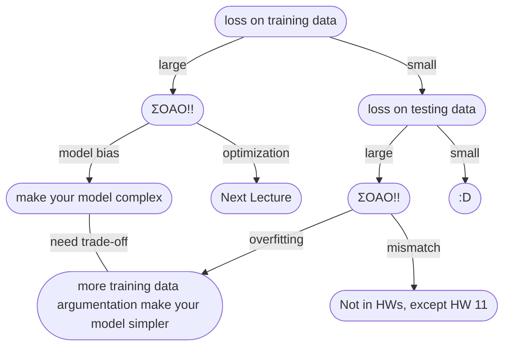

# MACHINE LEARNING 2022 SPRING

## 機器學習基本概念簡介

### 何謂機器學習

**Q: 什麼是機器學習?** 
*A: 概括來說，讓機器具備找一個函式的能力!*

### 函數的類型

**上面提到機器要找一個函數，這個函數被大致分為幾種**
* **Regression:** 輸出為一個數值 

* **Classification:** 從既有的選項 *(classes/類別)* 中，選擇其一輸出

* **Structured Learning:** 讓機器產生一個有結構的物件 *(e.g. 畫一張圖、寫一篇文章...)* ，讓機器學會創造

### 如何找一個函數

**以簡單預測YouTube流量為例...**
1. **Find with Unknown Parameters** 寫出帶有未知參數的函式

2. **Define Loss form Training Data** 定義損失函數
    * Loss is a function of parameters: L(b, w)
    * Loss: how good a set of value is

Loss: $$L = \frac{1}{N}\Sigma e_n$$

將每一天的誤差值加總起來取平均，就能得到損失函數的值 
計算誤差值的方式大致上有下列2種方法:
* **MAE** Mean Absolute Error
    $e = |y - \hat{y}|$
* **MSE** Mean Square Error
    $e = (y - \hat{y})^2$

依照需求和對任務的理解作選擇 
*如果* $y$ *和* $\hat{y}$ *都是機率分佈的話，則會選擇Cross-entropy(之後再說)*

**Error Surface:**
將各種參數組合出來的Loss值繪製成等高線圖

3. **Optimization** 最佳化 
$$w^*, b^* = \arg\min\limits_{w, b}L$$
*找一個最好的* $w$*和* $b$ *(* $w^*$ & $b^*$ *)，使得Loss的值最小*
**Gradient Descent:**
先遮住另一個參數，我們先看單一的參數...

:::info 
$\eta$ : learning rate *(a hyperparameters 自己設定的參數)* 
larning rate越高，學習越快 *(數值變化快)*
:::

如圖，Gradient Descent顯而易見的問題即是local minima問題，通常無法找到golbal minima，但老師提到local minima其實是個假議題，做Gradient Descent時會遇到的真正難題並不是local minima問題 *(之後再提Gradient Descent真正的痛點)* 
單一的參數理解之後，多個參數也是相同概念...
* (Randomly) Pick initial values $w^0, w^b$
* Compute 
$$w^1\leftarrow w^0-\eta\frac{\delta L}{\delta w}|_{w = w^0, b = b^0}$$
$$b^1\leftarrow b^0-\eta\frac{\delta L}{\delta b}|_{w = w^0, b = b^0}$$
* Update $w$ and $b$ interatively

### 訓練 & 預測
上面的步驟其實就是在訓練

如圖，在已知的資料上的最小Loss是0.48k，而在預測的數據上，Loss則是來到0.58k

 
根據第一次預測的結果，我們可以發現這些資料有存在週期性 *(在此為7天一循環，星期四和星期五的觀看人數都會減少)*，利用這個週期性來嘗試修改模型... 
以上這些`feature * weight + bias`的模型就稱為 **Linear Models**

### 模型
Linear Models很顯然是不夠的，它有著很大的限制，稱作**Model Bias**，使得這個模型無法模擬真實的狀況，因此我們需要更複雜、更有彈性的模型

**Piecewise Linear Curves**
上面這條紅線其實就是Piecewise Linear Curves *(分段線性曲線)*，我們可以發現這種曲線可以整理成下列的式子: 
red curve = constant + sum of a set of blue cruve

如圖，利用不同的藍色曲線加上一個常數，就形成了紅色分段線性曲線 *(red curve = 0 + 1 + 2 + 3 curves)*

**Q: 但x和y的關係不一定是Piecewise Linear Curves啊，那該怎麼辦?** 
*A: 先在曲線上取幾個點，再連起來形成Piecewise Linear Curves，只要點取得夠好或**夠多**，就能和原本的曲線非常接近*

**Q: 那要如何得到藍色曲線呢?** 
*A: 我們可以用**Sigmoid Function**來嘗試逼近它*

而我們上面一直在講的藍色曲線則是叫做**Hard Sigmoid**

透過改變$w$、$b$和$c$，就能去逼近出各種不同的Sigmoid Function

回到這一張圖...

我們就成功把紅色分段曲線表示出來了 

**整理一下我們的新模型:**
* 單個feature
$$y = b + wx_1\\\downarrow\\ y = b + \sum_i \color{red}{c_i}sigmoid(\color{green}{b_i} + \color{blue}{w_i}x_1)$$
* 多個feature
$$y = b + \sum_j w_jx_j\\\downarrow\\ y = b + \sum_i \color{red}{c_i}sigmoid(\color{green}{b_i} + \sum_j \color{blue}{w_{ij}}x_j)$$
下面實際演示了這個模型...

可以將 $r_1$、 $r_2$ 和 $r_3$ 的運算簡寫成如下:
 
接著，將 $r_i$ 代入 $sigmoid$ 函數得到 $a_i$ (可表示成 $a = \sigma(r)$， $a$ 、 $r$ 是矩陣， $\sigma$ 是 $sigmoid$ )，最後加上 $b$ 得到 $y$ ，如下圖:

經過整理後得到 $y$ 的線性代數表達法:

接著將每個未知參數組成一個很長的向量矩陣 $\theta$:

這樣我們就重新定義了機器學習的第一步

### 新模型的Loss函數 & 最佳化

#### Loss函數

代入的參數由原本的 $w$ 和 $b$ 換成了 $\theta$
$$L(w, b)\rightarrow L(\theta)$$

可以發現，除了參數不一樣以外，其他都和上面介紹的Loss函數一樣

#### 最佳化

$$
\theta^* = \arg\min\limits_{\theta}L, 
\theta = 
\left[
\begin{matrix}
& \theta_1\\
& \theta_2\\
& \theta_3\\
& \vdots &
\end{matrix}
\right]
$$
* (Randomly) Pick initial values $\theta^0$
* Compute gradient $g$
$$
g = 
\left[
\begin{matrix}
& \frac{\delta L}{\delta\theta_1}|_{\theta = \theta^0} \\
& \frac{\delta L}{\delta\theta_2}|_{\theta = \theta^0} \\
& \vdots &
\end{matrix}
\right],
\left[
\begin{matrix}
& \theta_1^1 \\
& \theta_1^2 \\
& \vdots &
\end{matrix}
\right] \leftarrow
\left[
\begin{matrix}
& \theta_0^1 \\
& \theta_0^2 \\
& \vdots &
\end{matrix}
\right] -
\left[
\begin{matrix}
& \color{red}{\eta}\frac{\delta L}{\delta\theta_1}|_{\theta = \theta^0} \\
& \color{red}{\eta}\frac{\delta L}{\delta\theta_2}|_{\theta = \theta^0} \\
& \vdots &
\end{matrix}
\right]
$$
$$g = \nabla L(\theta^0), \theta^1 = \theta^0 - \color{red}{\eta}g$$
* 不停地做直到gradient為零向量 *(Zero Vector)* 或不想做為止

**實作上，我們會將N筆資料切成一個一個Batch...**

每做一個Batch就會**update**一次，把所有Batch都做完一輪稱為**1 epoch**

:::success
:mag_right: **Example**
#### Example 1
* 10000 examples (N = 10000)
* Batch size is 10 (B = 10) 
How many update in **1 epoch**? 
*A: 10000 / 10 = **1000 updates***
#### Example 2
* 1000 examples (N = 1000)
* Batch size is 100 (B = 100) 
How many update in **1 epoch**? 
*A: 1000 / 100 = **10 updates***
:::

### ReLU

其實不一定要像上面透過**Sigmoid**函數來近似，也可以將<b>Hard Sigmoid</b>看成兩個 **Rectified Linear Unit (ReLU)** 的加總

:::info
:information_source: 這裡的 $\color{red}{2}i$ 是因為要合成1條**Hard Sigmoid**需要2條**ReLU**
:::
<b>Q: 那這上面兩個哪個比較好呢?</b> 
*A: ReLU，老師接下來的實驗都選擇了ReLU，顯然ReLU比較好 (至於為什麼，之後再講)*

### 實際實驗結果

越多的ReLU可以製造越複雜的曲線，不過到了1000個ReLU之後，雖然在訓練資料上有更低的Loss，但在預測上就沒有太大的進步  
接著我們繼續改進模型...

可以多做幾次: $x\rightarrow a\rightarrow a'\rightarrow \cdots$
這個也是**Hyper Parameter**，要自己決定做幾層，下面有實際的實驗數據...

增加層數，在訓練資料上Loss有顯著的降低，在預測上也有進步

可以發現在兩周一次的低谷的在預測上算是蠻精準的，不過這裡有個很有趣的地方，也就是在 ? 的地方，嚴重高估了觀看數值，這其實也不太能怪它預測的不精準，這一天其實是除夕，所以觀看數比預期的低很多

### 神經網路 & 深度學習

:::info
Many Neuron $\rightarrow$ Neuron Network 
Many hidden layer $\rightarrow$ Deep $\rightarrow$ Deep Learning
:::
於是人們把類神經網路越疊越多、越疊越深...

:::success
不過要訓練這麼深的Network是有訣竅的，這個之後再講...
:::

**Q: 要逼近一個複雜的函數，實際上只要有夠多的ReLU和Sigmoid就可以逼近任何的連續函數，理論上只要一排ReLU或Sigmoid夠多就足夠了，為何要深呢? 胖不行嗎? 只是單純"Deep" Network比"Fat" Network看起來更厲害嗎? 為何我們不要把Network變胖，而是變深呢?** 
*A: 好問題! 之後會再講*

**Q: Deep Network越深就一定越好嗎?** 
*A: 不一定，有可能會出現 **Overfitting(過度擬合)** 的現象*

## 機器學習任務攻略

:::info
:information_source: trade-off: split your training data into training set and validation set for model selection
:::

 

:::warning
:pushpin: **狀況1: 訓練資料的Loss就很大!!** 
*可能是Model Bias或Optimization Issue*
:::

### Model Bias

這個狀況是Model太過簡單了，導致在這個一堆函數所成的集合裡面，即便是最好 *(讓Loss最低)* 的函數Loss也還是很高。換句話說，就是可以讓Loss變低的函數，不在這個model可以描述的範圍之內。下圖清楚的表示了這個狀況...
:::info
:paperclip: 老師這裡下了一個比喻: 就好比你在大海撈針，但海裡根本沒有針
:::

:::success
:heavy_check_mark: **解決方法:** 重新設計model讓它更有 "彈性" !

:::

### Optimization Issue

目前我們只學到gradient descent的方法做optimization，這個方法有個顯而易見的問題: 通常無法找到golbal minima! 
 
這個model裡面確實有存在一個函數的Loss是夠低的，但gradient descent卻沒有給我們這個函數
:::info
:paperclip: 老師這裡也下了一個比喻: 就好比你在大海撈針，針確實在海裡，但我們卻沒辦法把針撈起來(找不到QAQ)
:::

### Model Bias v.s. Optimization Issue

這個時候就會開始吶喊，蛤所以到底是哪個狀況啊? 到底是model不夠大，還是model夠大了，只是我們沒辦法找到夠好的函數? 該怎麼判斷呢?
:::success
可以透過比較不同的model來得知說model到底夠不夠大!
:::
先來看下面的實例...

試著分析一下，首先我們看到在Testing Data這方面，56-layer的Loss比20-layer的Loss高，先別以為就是overfitting，我們再看一下Training Data，發現56-layer的Loss還是比20-layer來得高，如果是overfitting理論上56-layer在Training Data上應該要比20-layer有更低的Loss，==但這個狀況卻是不管Testing Data還是Training Data都是56-layer有更高的Loss，代表這是Optimization Issue，56-layer沒做好optimization，找不到更低Loss的函數，所以Loss才會比20-layer高!==
:::info
:bulb: **老師的建議** 
遇到沒做過的問題，可以先跑一些比較小、比較淺的network，或是用一些不是deep learning的方法 *(e.g. linear model, support vector machine...)* ，這些model是比較容易做optimize的，比較不會有optimization失敗的問題，之後便於和深的model比較Loss
:::
這也是Optimization Issue，發生在5 layer

:::success
:heavy_check_mark: **解決方法:** 更強大的Optimization技術!! *(下一節課再講)*
:::

### Overfitting & Mismatch

:::warning
:pushpin: **狀況2: 訓練資料的Loss小，但是測試資料的Loss大!!** 
*可能是Overfitting或Mismatch*
:::
下面舉一個極端的例子...
:::success
:mag_right: **An extreme example**  
Training data: 
$$\{(x^1, \hat{y^1}), (x^2, \hat{y^2}), \dots, (x^N, \hat{y^N})\}$$
Model:
$$
f(x) =
\begin{cases}
\hat{y^i} & \exists x^i = x \\
random & otherwise
\end{cases}
$$
This function obtains **zero training loss**, but **large testing loss.**
:::
上面可以看到，這個函數簡直一無是處，如果訓練資料有相同的 $x^i$ 就輸出跟訓練資料一模一樣的 $\hat{y^i}$ ，如果沒有，就隨機輸出。雖然在training data上的loss是0，但拿到testing data上的表現是極為糟糕的  

**日常會遇到的例子:**

太過有彈性的model在沒有訓練到的地方就會有 **"freestyle"** 導致在Testing data有較大的Loss
:::success
:heavy_check_mark: **解決方法:**  
1. 增加訓練資料!  <i>只要有更多的訓練資料就能限制住函數的形狀，減少"freestyle"的發生</i> <i>(不可在作業中使用)</i> 但可以使用: Data Augmentation  <i>e.g. 將圖片左右翻轉、截一塊出來放大...(但是要合理)</i>

2. 給模型一些限制!  
<i>
要給多少限制取決於自己對問題的理解 ~~(自己通靈)~~ 限制的方法:  
    * Less parameters, sharing parameters
    * Less features
    * Early stopping
    * Regularization
    * Dropout
</i>
:::

**CNN**  
  
相比一般的Fully-connected架構，CNN的限制較多，它可以找到函數較少，但它因為針對影像的特性來限制model，所以CNN在影像上的表現較好
:::danger
:x: **注意 限制不可過多**
限制過多 $\rightarrow$ model bias問題\

:::

**Bias-Complexity Trade-off**

**Cross Validation**\
為了避免糾結在public testing set上面，應該將training set拆出validation set *(通常9:1)* 根據validation set出來的loss來挑選模型
